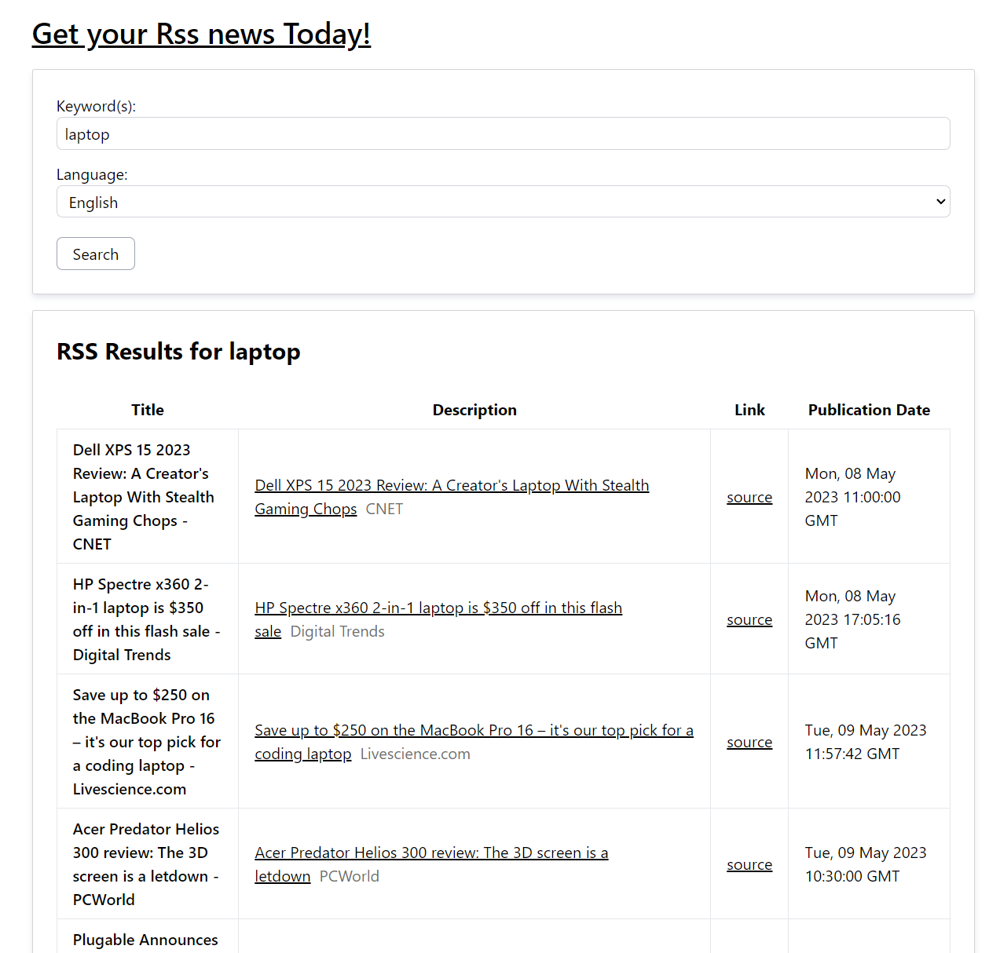
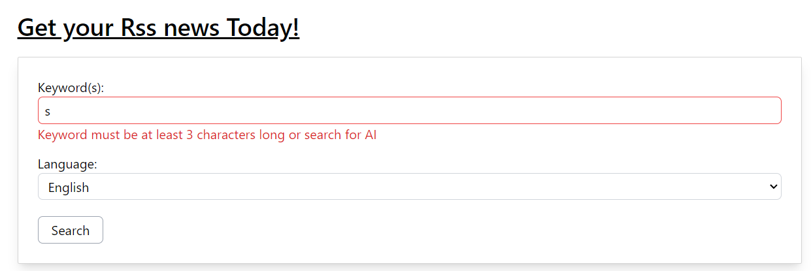

# RSS feed fetching app

The app where you can ger rss in your favorite topic by searching in 3 diffenrent languages.
Just enter a topic, select language and see the results.

- Front end Vue.js cli app,
- Back end PHP 8
- Rss feed is from [news.google](https://news.google.com/rss/search)

## instalation

1. `npm run build` - creates 'dist/' folder to be used as the public folder on the server
2. dist/ folder is the folder that can hosted for the app to work.

## commands

### fe

1. `npm install` instals fe dev dependancies
2. `npm run build` builds the dist/ folder

### be

1. public/backend/ is the root back end folder in development mode. all composer commands run there.
2. `npm run build` copies backend folder to dist/ folder

## screenshots

## The app is a bit upside down

I have more experience in front end. There for my app is build so that the back end is inside the front end. I understand it should be other way around. But i have not know the right way to do that. In order for this to work as it should I should put 'dist' folder inside 'backend' folder as 'public' and make the server root folder 'public' and route the trafic to be index.php to process the Post requests. I have failed to do that.
But Other than that, app works as it is.

### Author Marius Kuzminskas
